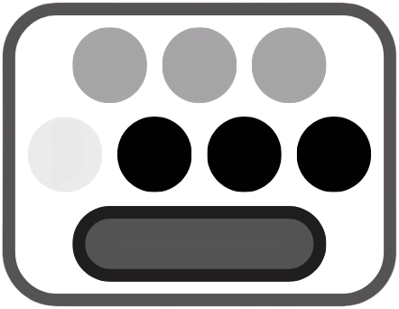
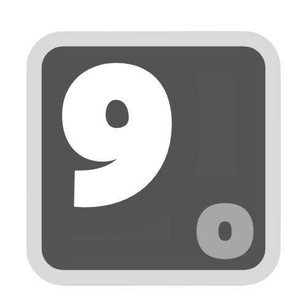
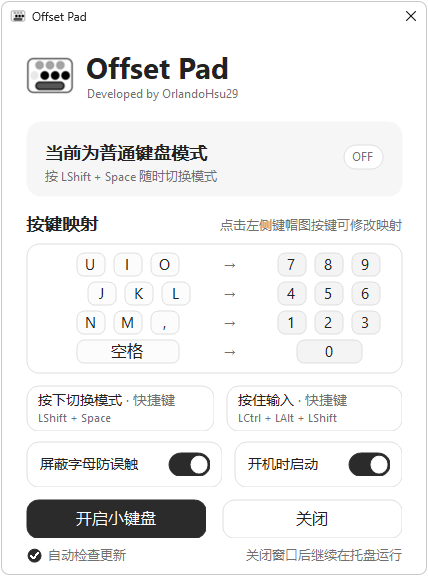

# Offset Pad

Offset Pad 给没有独立数字小键盘的小配列键盘增加一个数字键层，支持 Windows x64。

## 为什么做这个

小配列键盘通常没有独立数字小键盘。虽然日常打字很少用到它，但在处理表格或集中录入数字时，九宫格布局又很顺手。

Offset Pad 把右手打字区临时变成近似九宫格的小键盘。左手按快捷键切换，右手保持原来的打字位置，就能按熟悉的布局输入数字；用完再切回普通键盘，无需移动手腕或另外接一个小键盘。

## 快速开始

1. 运行 Windows x64 安装包，安装并打开 Offset Pad。
2. 点击“开启小键盘”，或按默认快捷键 **Shift + 空格** 切换模式；按住 **Shift + Caps Lock** 可临时切换为小键盘模式，松手后恢复为正常模式。（由于顺手的快捷键已经被很多软件占用了，所以专门适配了 Caps Lock 键作为快捷键，用「Caps + 功能键」作为快捷键不会干扰 Caps 原有的大小写锁定功能，推荐使用默认快捷键。）
3. 点击“按键映射”中左侧的键帽，按字母、数字、常用符号或空格重新绑定；按 Esc 取消。已占用的键会与原键交换。
4. 设置窗口可分别设置“切换模式”和“按住输入”：按住后暂时输入数字，松开即恢复此前模式；按住输入期间按 Backspace 只删除一个字符。录入时会区分左右 Ctrl、Alt、Shift 和 Win，并显示为 LCtrl、RCtrl 等；按 Delete 或 Backspace 可清除录入中的快捷键；托盘菜单可禁用两种快捷键，单独的模式开关仍可使用。还可设置“屏蔽字母防误触”和“开机时启动”。

默认映射如下：

| 原键 | 输出数字 |
| --- | --- |
| `U` `I` `O` | `7` `8` `9` |
| `J` `K` `L` | `4` `5` `6` |
| `N` `M` `,` | `1` `2` `3` |
| 空格 | `0` |

“屏蔽字母防误触”默认开启；开启后，仅在小键盘模式下拦截未映射的普通字母输入，Ctrl/Alt/Win 组合键仍可使用。若 1.5 秒内按下 3 次未映射字母，程序会通过系统通知提醒当前模式；同一次开启小键盘时提醒至少间隔 10 秒；切回普通模式再开启后可立即重新触发。

关闭设置窗口后，程序仍在系统托盘运行。托盘图标为 `O` 时是普通键盘模式，为 `9` 时是数字小键盘模式；右键图标可以切换模式、禁用快捷键或退出程序。映射直接输入数字字符，不受 Num Lock 状态影响。

| 普通键盘模式 | 数字小键盘模式 |
| :---: | :---: |
|  |  |

## 界面预览

## 自动检查更新

启用“自动检查更新”后，Offset Pad 每次启动时会查询 GitHub Releases；发现新版本时通过系统托盘通知提示。此功能只检查并打开发布页，不会自动下载或安装。

源码构建与项目结构见 [src/README.md](src/README.md)。

本项目采用 [MIT License](LICENSE)。
